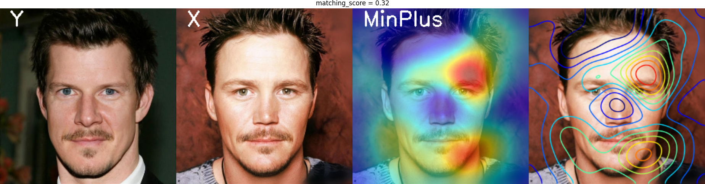
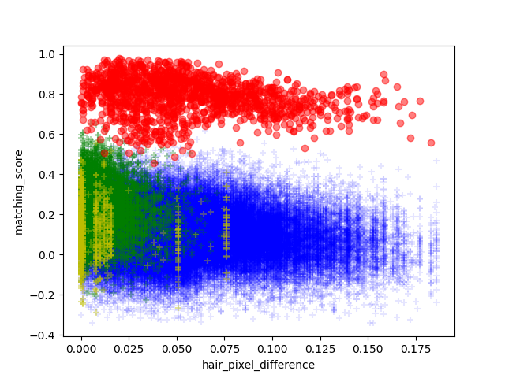

In this part,

+ Codes for feature extraction and matching score calculation are updated.
+ [MinPlus](https://colab.research.google.com/drive/1AL2aEEyZOWJTyTaspFQcry_1g0E4b4x5?usp=sharing#scrollTo=3m46JmcMKX-b) visualization technique for face verification is implemented.
+ [Facial Hair Segmentation](./segmentation/) network is improved using more training data.
+ 50 frontal face images with are selected from the [CelebA-HQ](https://github.com/switchablenorms/CelebAMask-HQ) dataset and using [FaceApp](https://www.faceapp.com) 7 different synthetic facial hair styles are obtained to investigate effects of hair style variation for face matching.

### Visualization

In this work, we use MinPlus saliency map method, proposed in [True Black-Box Explanation in Facial Analysis](https://openaccess.thecvf.com/content/CVPR2022W/Biometrics/papers/Mery_True_Black-Box_Explanation_in_Facial_Analysis_CVPRW_2022_paper.pdf), to find most relevant image regions for [ArcFace](https://openaccess.thecvf.com/content_CVPR_2019/papers/Deng_ArcFace_Additive_Angular_Margin_Loss_for_Deep_Face_Recognition_CVPR_2019_paper.pdf) feature descriptor. Heatmaps produced by this method are obtained using a removal strategy, an aggregation strategy and then combination of these two steps. Looking the matching scores of two images, one is reference and the other is a probe image, these two steps are applied iteratively until it reaches a threshold value or a maximum number of iteration defined. The probe image can be the same image with the reference or can be a different image than the reference.

  

### Experiments
In our experiments, we observe how the saliency map is changing with the images;

+ genuine pairs
+ clean shaven imposter pairs
+ imposter pairs with the same facial hair style
+ imposter pairs with different facial hair style

Observation includes visual evaluation of saliency maps with the produced matching score for an image pair. Also, the facial hair segmentation network is used to calculate size of facial hair in face images. Number of pixels masked by the network is summed and relation with the matching score is plotted.

  

 
  - green: imposter pairs with the same facial hair style,
  - red: genuine pairs,                   
  - blue: imposter pairs with different facial hair style
  - yellow: clean shaven imposter pairs

##### Results

50 identities are used to create image pairs. Each person has one clean-shaven image and 7 different facial hair styles obtained by the clean-shaven image using FaceApp. In total 400 * 399 / 2 = 79800 pairs are created. Subsets of 1400 genuine pairs, 1225 clean shaven imposter pairs, 8575 imposter pairs with the same facial hair style and 68600 imposter pairs with different facial hair style are used to investigate the effects of facial hair. The figure above shows the matching score and facial hair size difference of each image pair. By looking the plot we can say;
- matching scores of genuine pairs get lower when pairs have greater facial hair difference (in terms of number of pixels)
- imposter pairs with the same facial hair style get higher matching scores compared to the other imposter pairs particularly when they have a close number of facial hair pixels.

It is important to note that, it can be expected for imposter pairs with the same facial hair style to have some variation on facial hair sizes but for clean shaven imposter pairs the facial hair size difference must be zero. It can be seen on the plot above that these pairs depicted with yellow mostly have zero values but also have values greater than zero. One reason is that the segmentation network is sensitive to short five o'clock shadows and the 50 clean shaven images selected actually might have short hair detected by the network (see [examples](./segmentation/samples)). The second reason is even neural networks make mistakes sometimes:)

In our observations, MinPlus visualization technique is found helpful to explain greater matching scores for imposter pairs by showing heatmaps focusing on beard area in some pairs. However, computational time is too high to get meaningful results most of the time and we did not consider producing heatmaps for all pairs.

### Code

Images in the 'data_example' folder are used to calculate matching scores and number of facial hair pixels. It has 2 identities and 3 images per identity.

Run **segmentation/predict_facial_hair_mask.py** to obtain the number of pixels masked by the network. Result will be saved to 'no_hair_pixels.pkl'.

Run **calculate_matching_score.py** to get matching scores. Result will be saved to 'matching_scores.pkl'. Run with "-v" to visualize and save saliency maps. Results will be saved to 'Contour.png' and 'heatmap_MinPlus.png'.

Run **plot_score_vs_no_hair_pixels.py** to plot pairs. Result will be saved to 'plot.png' (Run after getting 'matching_scores.pkl' and 'no_hair_pixels.pkl').
