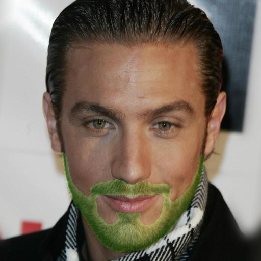

# Facial Hair Segmentation
A semantic segmentation network is trained to mask facial hair on face images in this project.

### BiSeNet
[The Bilateral Segmentation Network (BiSeNet)](https://openaccess.thecvf.com/content_ECCV_2018/papers/Changqian_Yu_BiSeNet_Bilateral_Segmentation_ECCV_2018_paper.pdf) is proposed to both increase inference speed and preserve the spatial information to produce high resolution features for segmentation. A [publicly-available implementation](https://github.com/zllrunning/face-parsing.PyTorch) is utilized to train a neural network for facial hair segmentation in this work. The network is trained from scratch using hand-annotated facial hair masks on CelebA-HQ dataset. 

#### Training
1800 images are annotated using [labelme](https://github.com/wkentaro/labelme) annotation tool. 1500 images are used for training and 150 validation images are used to pick the best network during training by looking the IoU on every epoch. Then, performance of the best network is measured on 150 test images. 84.3% and 84% IoU are achieved on validation and test set respectively. 

  

#### Code

[Download the segmentation network](https://drive.google.com/file/d/1KSa9_g_cL047Z0B2hEn8cRPsDP7sjPXC/view?usp=share_link).

Run **predict_facial_hair_mask.py** to produce facial hair masks for the images in the 'data_example' folder. The produced images will be saved in the 'seg_results' folder.

Number of annotated pixels are calculated and saved to '../no_hair_pixels.pkl'.
